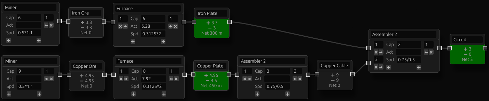

https://cyb0124.github.io/factory-balancer/

This is a simple tool for calculating the balance between resource production rate and consumption rate in factory automation games.

You create a graph of processes (e.g. miners, furnaces, assemblers) and resources (e.g. iron, copper, cables, circuits). The tool calculates the net rate (production rate minus consumption rate) of each resource. A positive net rate (marked green) means it is produced faster than being consumed; a negative net rate (marked brown) means it is consumed faster than being produced. Ideally, all intermediate resources should have zero net rate, meaning production and consumption are balanced.

Each process has 3 common parameters:
- **Capacity** (Cap): total number of this machine you have placed.
- **Activity** (Act): how many of this machine is actually running (optional).\
  You can click the arrow button at each input/output to automatically set this number so that the connected resource would end up with zero net rate.
- **Speed** (Spd)

You can enter simple math expressions in every field that accepts numbers. e.g. if a recipe takes 6 seconds, speed can be entered as `1/6`.